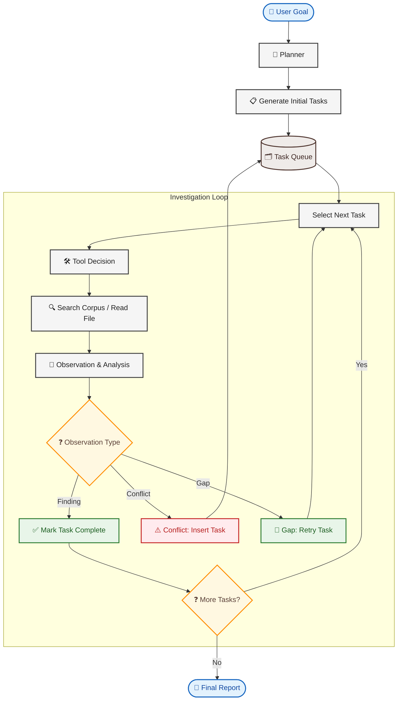

# Legal Investigation AI Agent

Autonomous due diligence agent for M&A legal review. Given a natural language goal and a corpus of legal documents, the agent plans an investigation, reads documents, records findings and conflicts, and produces a structured report.


## Problem Statement
When one company wants to buy another, lawyers have to read hundreds of pages of contracts, corporate filings, and court records to find risks. This AI assistant automates that process: it takes a goal (like *"Can Company A safely buy Company B?"*), plans its own search across a folder of local documents, reads them, flags any missing papers or conflicting claims, and writes a clear summary report.

---

## 🚀 Quick Start

### 1. Installation
First, install the necessary Python packages:
```bash
pip install -r requirements.txt
```

### 2. Set Up Your API Key
Create a file named `.env` in the project root folder and add your OpenAI API key like this:
```env
OPENAI_KEY=your-api-key-here
```

### 3. Run the Assistant
To start an investigation on a sample set of documents:
```bash
python -m agent.runner "Can Orion Capital safely acquire Nexus Legal Technologies?" data/documents
```

The assistant will:
1. Look at all the files available in the folder.
2. Create an investigation plan (a list of questions to answer).
3. Read the files, search for keywords, and take notes.
4. Print its step-by-step thinking to the screen.
5. Save a detailed log file in the `logs/` folder.
6. Print a final summary report showing what it found, what was missing, and any risks.

---

## 📊 Running the Tests

We built a testing program (an "evaluation harness") to check how well the assistant performs when files are missing or contain conflicting information.

To run the tests:
```bash
# Run a single test scenario
python eval/harness.py --scenario S1

# Run all test scenarios and save the results
python eval/harness.py --all --output results/eval_results.json
```

---

## 🛠 How the Assistant Works

Instead of trying to read everything all at once, the assistant works like a human investigator using a simple loop:





### The 4 Files That Power the Agent:
* [agent/state.py](file:///Users/omerkhanjadoon/Documents/libra/agent/state.py) — Stores the list of questions, notes, and files read so far.
* [agent/tools.py](file:///Users/omerkhanjadoon/Documents/libra/agent/tools.py) — The tools the AI uses to list files, read them, and search for keywords.
* [agent/planner.py](file:///Users/omerkhanjadoon/Documents/libra/agent/planner.py) — The "brain" of the AI. It handles planning, choosing tools, interpreting search results, and writing the final report.
* [agent/runner.py](file:///Users/omerkhanjadoon/Documents/libra/agent/runner.py) — The engine that runs the loop, prints the status to your screen, and saves log files.

---

## 💡 Key Design Choices

### 1. Simple Notes over Full History
Many AI tools send the entire conversation history back and forth on every step. This makes them slow and expensive. Instead, our assistant keeps a simple list of **Notes** (Findings, Gaps, and Conflicts). The AI only looks at these notes and its current plan to make its next move. 
<br/>In many AI agents, the message history grows O(n) with loop iterations i.e by step 15 you are paying for every prior tool call in every subsequent prompt. I switched to an O(1) state snapshot: current step count, the plan, and the notes recorded so far. That is always under ~300 tokens regardless of how many steps have run. The tradeoff is that the LLM does not see verbatim tool output from prior steps, but that is fine because the *note* from each step is what matters, not the raw text.

### 2. Splitting Up the Decisions
Instead of asking the AI to "read this search result, decide what it means, and pick the next tool" all in one prompt, we split it into separate, focused steps:
* **Step A:** Pick a tool to search for information.
* **Step B:** Read the search result and record what was learned.
This split makes the AI much more accurate.

### 3. Using Keyword Search (BM25) Instead of Vector Search
We chose a direct keyword search rather than modern "vector search" because keyword search is predictable. If we search for a word like "litigation" and get zero results, the AI knows for sure that the word isn't there and can immediately flag a missing document. Vector search often returns irrelevant results instead of a clear "not found" signal, which can confuse the AI.

---


## What I would do with more time

The thing I would change first is retrieval. BM25 requires exact term overlap and that is a meaningful constraint on legal language, which is full of synonymy ("IP assignment" vs "intellectual property transfer"). A **hybrid pipeline — BM25 plus dense embeddings plus a cross-encoder reranker** — would catch the cases the current system misses silently, and it would also let the agent send the top-3 relevant paragraphs to the LLM instead of full documents, cutting token usage significantly.

The second thing I would address is **Conflict Classification**. Right now the observer sometimes records a conflict as a plain finding if the contradiction is subtle. I would make this a separate, targeted prompt — "here are two notes from different documents, do they contradict each other?" — rather than asking the observer to detect conflicts while also extracting a note from a single result. Focused calls beat multipurpose ones.

The third thing is **Parallelism**. Independent investigation questions (litigation history, IP chain of title, corporate structure) have no dependency between them and could run concurrently. The current sequential loop is simple and correct but slow at ~20 minutes per run. An async task queue would reduce that to a few minutes without changing any of the core logic.


## Evaluation Method: 

Four scenarios are defined in `eval/scenarios.py`:

| ID | Name | Corpus | Min required passes |
|----|------|--------|---------------------|
| S1 | Full Corpus — Happy Path | All 7 documents | 5 / 5 |
| S2 | Missing Litigation Register | 6 documents | 3 / 5 |
| S3 | Missing IP Assignment | 6 documents | 3 / 5 |
| S4 | IP Conflict Detection — Narrow Corpus | 2 documents | 1 / 5 |

Scoring uses an adversarial LLM judge (gpt-5.6-sol, temperature=0) via the Libra Azure endpoint. Ten rubric criteria are defined in `eval/rubric.py`; five are required.

## Evaluation Results


The assistant was tested against four scenarios with different document folders (some complete, some with missing files):

| Test Case | Description | Score | Result |
|:---|:---|:---:|:---:|
| **Test 1: Full Corpus** | All documents present. | 9.5 / 10 | ✅ PASS |
| **Test 2: Missing Court Records** | Court history register was withheld. | 8.0 / 10 | ✅ PASS |
| **Test 3: Missing Ownership Contract** | Main technology transfer contract was withheld. | 9.0 / 10 | ✅ PASS |
| **Test 4: Bare Minimum Info** | Only 2 documents provided. | 5.5 / 10 | ✅ PASS |

For a detailed breakdown of what these scores mean and how we graded the AI, see the [docs/evaluation.md](file:///Users/omerkhanjadoon/Documents/libra/docs/evaluation.md) document.


## Known limitations

**Azure sandbox throttling:** The Libra endpoint enforces a 100k TPM rate limit and can return HTTP 500 under peak load. The agent retries both `RateLimitError` (429) and `InternalServerError` (500) with exponential backoff (30/60/90/120/150 s, 6 attempts). Investigation runs may take 10–30 minutes depending on sandbox load.