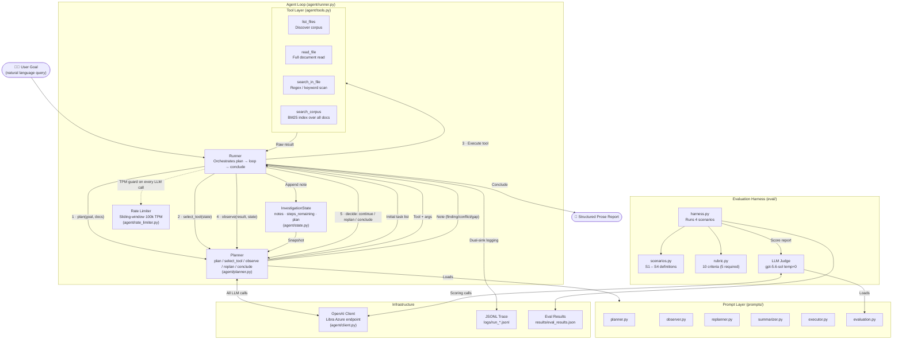

# Legal Investigation Agent

Autonomous due diligence agent for M&A legal review. Given a natural language goal and a corpus of legal documents, the agent plans an investigation, reads documents, records findings and conflicts, and produces a structured report.

## Setup

```bash
pip install -r requirements.txt
```

Create a `.env` file in the project root with your Libra interview API key:

```
OPENAI_KEY=<your-libra-api-key>
```

The client targets the Libra Azure endpoint (`libra-ai-interviews.services.ai.azure.com`) using model `gpt-5.6-sol` via the OpenAI Responses API.

Python 3.10+ required (uses `match` statement and `Literal` type hints).

## Running the agent

```bash
python -m agent.runner.py "Can Orion Capital safely acquire Nexus Legal Technologies?" data/documents
```

The agent:
1. Lists available documents
2. Plans 5–10 investigation questions covering all five due diligence categories
3. Loops: selects a tool, executes it, observes the result, decides to continue / replan / conclude
4. Writes a timestamped JSONL trace to `logs/`
5. Prints a structured prose report to stdout

Log events printed to stdout: `[PLAN]`, `[TOOL]`, `[RESULT]`, `[OBSERVE]`, `[DECIDE]`, `[REPLAN]`, `[GUARD]`, `[CONCLUDE]`.

## Running the evaluation harness

```bash
# Single scenario
python eval/harness.py --scenario S1

# All scenarios with JSON output
python eval/harness.py --all --output results/eval_results.json
```


## Architecture

Following key files: 

```
agent/state.py     — Note and InvestigationState dataclasses
agent/tools.py     — list_files, read_file, search_in_file, search_corpus (BM25 index)
agent/client.py    — shared OpenAI client singleton (Libra Azure endpoint)
agent/planner.py   — all OpenAI calls: plan, select_tool, observe, replan, conclude
agent/runner.py    — the agent loop (plan → loop → conclude) and dual-sink logging
agent/rate_limiter.py — sliding-window TPM limiter (100k TPM / 90% safety margin)
```

See `docs/architecture.md` for the full design rationale.

### System Design



**Loop invariants:**
- State passed to every LLM call is an O(1) snapshot (remaining steps + notes), not accumulated message history.
- Tool results are never accumulated — only the note extracted from them is kept.
- The loop exits on three conditions: planner decides `conclude`, plan is exhausted, or 20-iteration guard fires.


### How the agent works

The agent is a tight loop with three moving parts: a **planner**, a **toolset**, and a **state object**.

At startup the planner is given the user's goal and the list of available filenames. It produces an ordered list of investigation questions — one per due-diligence category — and those become the plan. Then the loop begins: for each question, the planner picks a tool and arguments, the tool runs, and the raw result goes back to the planner as an "observer" call that extracts a single structured note (`finding`, `gap`, or `conflict`) and decides what to do next. If evidence is thin it replans; if everything is answered it concludes. The final report is synthesised from the notes alone — never from raw tool output or message history.

The design is intentionally flat. There is no framework, no event bus, no plugin registry. The main loop is 50 lines and reads left to right.

### Key decisions and why

**Structured state over message history.** The biggest early decision. An accumulating message history grows O(n) with loop iterations — by step 15 you are paying for every prior tool call in every subsequent prompt. I switched to an O(1) state snapshot: current step count, the plan, and the notes recorded so far. That is always under ~300 tokens regardless of how many steps have run. The tradeoff is that the LLM does not see verbatim tool output from prior steps, but that is fine — the *note* from each step is what matters, not the raw text.

**`select_tool` and `observe` as separate LLM calls.** I initially merged them into one prompt ("here is the result, pick the next tool and tell me what this means"). The outputs were worse — the model hedged on both decisions when forced to do them simultaneously. Splitting them into two focused calls (one decision each) improved note quality noticeably, and it is easier to tune two small prompts than one large one.

**BM25 instead of embeddings for retrieval.** BM25 fails loudly: if a query returns nothing, the agent knows the term is absent and can replan around it. A vector index returns results regardless of quality — a low-relevance match looks identical to a high-relevance one, making gaps invisible. For a legal investigation where a missing clause is as important as a present one, transparent failure is more valuable than higher recall. The agent compensates by issuing several semantically varied queries per question and falling back to `read_file` when search is sparse.
Also i currently dont have access to the embedding models , So implementing RAG was not possible.

**One `Note` dataclass with a `kind` field.** Findings, gaps, and conflicts are structurally identical: a category, a description, and source references. I started with three separate dataclasses and deleted them — the `kind` field carries the same information with a third of the code.


### What I would do with more time

The thing I would change first is retrieval. BM25 requires exact term overlap and that is a meaningful constraint on legal language, which is full of synonymy ("IP assignment" vs "intellectual property transfer"). A hybrid pipeline — BM25 plus dense embeddings plus a cross-encoder reranker — would catch the cases the current system misses silently, and it would also let the agent send the top-3 relevant paragraphs to the LLM instead of full documents, cutting token usage significantly.

The second thing I would address is conflict classification. Right now the observer sometimes records a conflict as a plain finding if the contradiction is subtle. I would make this a separate, targeted prompt — "here are two notes from different documents, do they contradict each other?" — rather than asking the observer to detect conflicts while also extracting a note from a single result. Focused calls beat multipurpose ones.

The third thing is parallelism. Independent investigation questions (litigation history, IP chain of title, corporate structure) have no dependency between them and could run concurrently. The current sequential loop is simple and correct but slow at ~20 minutes per run. An async task queue would reduce that to a few minutes without changing any of the core logic.


### Evaluation Method: 

Four scenarios are defined in `eval/scenarios.py`:

| ID | Name | Corpus | Min required passes |
|----|------|--------|---------------------|
| S1 | Full Corpus — Happy Path | All 7 documents | 5 / 5 |
| S2 | Missing Litigation Register | 6 documents | 3 / 5 |
| S3 | Missing IP Assignment | 6 documents | 3 / 5 |
| S4 | IP Conflict Detection — Narrow Corpus | 2 documents | 1 / 5 |

Scoring uses an adversarial LLM judge (gpt-5.6-sol, temperature=0) via the Libra Azure endpoint. Ten rubric criteria are defined in `eval/rubric.py`; five are required.

### Evaluation Results

All four scenarios passed. Full per-criterion breakdown in [docs/evaluation.md](docs/evaluation.md).

| Scenario | Name | Score | Required passes | Result |
|----------|------|------:|-----------------|--------|
| S1 | Full Corpus — Happy Path | **9.5 / 10** (95%) | 5 / 5 | ✅ PASS |
| S2 | Missing Litigation Register | **8.0 / 10** (80%) | 3 / 5 | ✅ PASS |
| S3 | Missing IP Assignment — Core Blocker | **9.0 / 10** (90%) | 3 / 5 | ✅ PASS |
| S4 | IP Conflict Detection — Narrow Corpus | **5.5 / 10** (55%) | 3 / 5 | ✅ PASS |

Notable: in S3 (IP assignment document withheld), the agent reconstructed the assignment from cross-references in the university licence and still scored 90%. In S4 (only 2 documents), the 55% absolute score is expected — categories absent from the corpus cannot be surfaced; the required threshold was 1 of 5 required passes (met with IP-01 and IP-02).


## Known limitations

**Retrieval quality:** The agent uses BM25 (`bm25s`) for corpus search rather than embeddings. BM25 requires term overlap between the query and the document — a query for "IP ownership" will not match a document that uses only "intellectual property assignment" without the word "ownership". The agent mitigates this by issuing several semantically varied queries per investigation step, and the planner prompt explicitly instructs `read_file` fallbacks when search returns sparse results.

**Conflict classification:** `conclude` is called once from `state.notes` only. If the observer failed to classify a note as `conflict` (recording it as `finding` instead), the summariser has no signal that a cross-document tension exists. This was observed with the Imperial licence / IP assignment conflict (IP-02): both documents were found and read, but the LLM sometimes classified the note as `finding` rather than `conflict`. Addressed with explicit conflict-detection instructions in the `observe` prompt and recent-note injection, but the model remains non-deterministic on borderline classifications.

**Azure sandbox throttling:** The Libra endpoint enforces a 100k TPM rate limit and can return HTTP 500 under peak load. The agent retries both `RateLimitError` (429) and `InternalServerError` (500) with exponential backoff (30/60/90/120/150 s, 6 attempts). Investigation runs may take 10–30 minutes depending on sandbox load.

